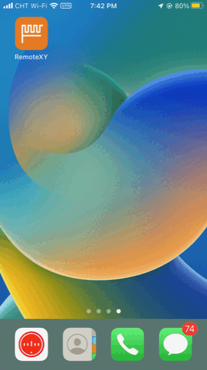
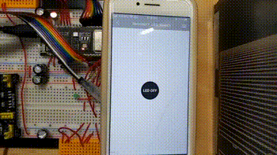

# ESP32-S3 RemoteXY BLE LED Control

A beginner-friendly project for controlling the **ESP32-S3-DevKitC-1U (N8R8)** using Bluetooth Low Energy (BLE) and the **RemoteXY** mobile app.

This project demonstrates how to:
1.  Configure PlatformIO for the **N8R8** (8MB Flash / 8MB PSRAM) module.
2.  Create a Mobile GUI (Switch & Indicators) without writing app code.
3.  Control the **Built-in RGB LED** (NeoPixel) and an **External LED** simultaneously.

---

## 📸 Project Demo

Here you can see the system in action.
* **Left:** The RemoteXY iOS App controlling the device.
* **Right:** The Physical ESP32-S3 and LED responding instantly.

| **App View (iOS)** | **Hardware View** |
| :---: | :---: |
|  |  |

---

## 🛠 Hardware Required

* **Development Board:** Espressif ESP32-S3-DevKitC-1U-N8R8 (or similar S3 board).
* **External LED:** Any standard LED (Red/Blue/Green).
* **Resistor:** 220Ω or 330Ω (for the external LED).
* **Smartphone:** Android or iOS with Bluetooth support.

## 🔌 Wiring & Pinout

| Component | ESP32-S3 Pin | Note |
| :--- | :--- | :--- |
| **Built-in RGB LED** | `GPIO 38` | Addressable NeoPixel (WS2812). Logic is handled by `neopixelWrite`. |
| **External LED (+)** | `GPIO 2` | Connect via resistor. |
| **External LED (-)** | `GND` | Common ground. |

> **Note:** Different ESP32-S3 boards may use different pins for the built-in RGB LED (e.g., GPIO 48). If yours does not light up, check your board's datasheet and update `PIN_RGB_BUILTIN` in `main.cpp`.

---

## 📂 Project File Structure

Here is an overview of the files in this project to help you navigate the code.

```text
ESP32-S3_RemoteXY_BLE_LED_Control/
├── docs/
│   └── remotexy_original_backup.cpp # Backup of the raw code from RemoteXY editor
├── img/
│   ├── app_demo_ios.gif             # Animation: App Walkthrough
│   ├── hardware_demo.gif            # Animation: Hardware Response
│   ├── remotexy_01_config.png       # Screenshot: Editor settings
│   ├── remotexy_02_editor.png       # Screenshot: GUI design
│   └── remotexy_03_code.png         # Screenshot: Generated code
├── platformio.ini                   # (CRITICAL) Project configuration file
├── src/
│   └── main.cpp                     # (MAIN) The actual source code (Setup, Loop)
└── README.md                        # This documentation file
````

### Key Files Explained

  * **`platformio.ini`**: This is the "Control Center". It tells PlatformIO which board you are using (`esp32-s3-devkitc-1`), sets the memory configuration (`qio_opi`), and automatically downloads the necessary libraries (`RemoteXY`).
  * **`src/main.cpp`**: This is where the magic happens. It contains the RemoteXY configuration array and the logic to control the LEDs.
  * **`docs/remotexy_original_backup.cpp`**: A clean reference copy of the code generated by the website, before any custom logic was added.

-----

## 💻 Software Setup

### 1\. Prerequisites

  * [VSCodium](https://vscodium.com/) or VS Code.
  * [PlatformIO](https://platformio.org/) extension installed.
  * [RemoteXY App](https://remotexy.com/en/download/) installed on your phone.

### 2\. Installation

1.  **Clone the repo:**
    ```bash
    git clone [https://github.com/welton5532/ESP32-S3_RemoteXY_BLE_LED_Control.git](https://github.com/welton5532/ESP32-S3_RemoteXY_BLE_LED_Control.git)
    ```
2.  **Open in PlatformIO:**
    Open VSCodium, go to the PlatformIO Home, and click "Open Project". Select this folder.
3.  **Upload:**
    Connect your ESP32-S3 via USB. Click the **Right Arrow (→)** icon in the bottom status bar to Build and Upload.

### 3\. Usage

1.  Open the **RemoteXY** app on your phone.
2.  Enable Bluetooth on your phone.
3.  Tap `+` (New Device) -\> `Bluetooth BLE`.
4.  Select **"ESP32S3\_Switch"** from the list.
5.  Toggle the switch on the screen.
      * **ON:** External LED turns ON, Built-in RGB turns **GREEN**.
      * **OFF:** Both LEDs turn OFF.

-----

## 📱 Deep Dive: Understanding RemoteXY

This project uses **RemoteXY**, a platform that allows you to create a mobile interface (GUI) for your microcontroller using a drag-and-drop editor.

### 1\. How it Works

Instead of writing Java or Swift code for a phone app, you define the interface inside your Arduino code.

  * **The Configuration Array (`RemoteXY_CONF`):** This array contains the layout of your buttons, sliders, and colors. When the phone connects, it downloads this array to build the UI on the screen.
  * **The Structure (`struct RemoteXY`):** This links the UI elements to C++ variables.
      * If you toggle the switch on the phone, `RemoteXY.pushSwitch_01` becomes `1`.

### 2\. How to Modify the GUI

If you want to add a slider, a joystick, or change the background color, follow these steps:

**1. Configuration**
Go to the [RemoteXY Editor](https://www.google.com/search?q=http://remotexy.com/en/editor/). Open the configuration menu and ensure you select:

  * **Connection:** Bluetooth BLE
  * **Board:** ESP32 (or ESP32-S3)
  * **IDE:** Arduino IDE

**2. Design Interface**
Drag and drop components (Switch, LED) from the left sidebar onto the phone screen.

  * *Tip:* Click on a component to change its variable name (e.g., `pushSwitch_01`).

**3. Get Code**
Click the green **"Get Source Code"** button.

  * Copy the `RemoteXY_CONF` array and the `struct` structure.
  * Paste them into your `main.cpp` replacing the old configuration.

### 3\. ⚠️ Critical Troubleshooting (The "Disconnect Bug")

If you generate code from the editor and the App disconnects immediately after connecting:

  * **Check the Array Length:** Look at the second number in the `RemoteXY_CONF` array.
      * *Bad:* `{ 255, 1, 0, 0 ... }` (Length says 1 byte, but array is larger).
      * *Good:* `{ 255, 64, 0, 0 ... }` (Length matches the actual array size).
  * **The Fix:** Manually update that number to match the total bytes of the array. **This project has already fixed this to `64`.**

-----

## 💾 Reference: Original Generated Code

This is the raw code generated by the RemoteXY editor for this project configuration. You can use this as a reference if you need to restore the original array settings.

> **Note:** You can view the full backup file here: [docs/remotexy\_original\_backup.cpp](https://www.google.com/search?q=docs/remotexy_original_backup.cpp)

\<details\>
\<summary\>Click to expand original code\</summary\>

```cpp
/*
  -- ESP32-S3_RemoteXY_LED_Switch --
  This source code was automatically generated by the RemoteXY editor.
*/

#define REMOTEXY_MODE__ESP32CORE_BLE
#include <BLEDevice.h>
#include <RemoteXY.h>

#define REMOTEXY_BLUETOOTH_NAME "RemoteXY"

#pragma pack(push, 1)
uint8_t RemoteXY_CONF[] =
  { 255,1,0,0,0,57,0,19,0,0,0,82,101,109,111,116,101,88,89,95,
  76,69,68,95,83,119,105,116,99,104,0,31,1,106,200,1,1,1,0,10,
  38,83,29,29,48,4,26,31,76,69,68,32,79,78,0,31,76,69,68,32,
  79,70,70,0 };

struct {
  uint8_t pushSwitch_01; // =1 if state is ON, else =0
  uint8_t connect_flag;  // =1 if wire connected, else =0
} RemoteXY;
#pragma pack(pop)

void setup()
{
  RemoteXY_Init ();
}

void loop()
{
  RemoteXY_Handler ();
}
```

\</details\>

-----

## ⚠️ Connectivity & Power Modes (iOS vs Android)

Bluetooth behavior varies significantly between operating systems when "Power Saving" modes are active.

### 🍎 iPhone (iOS) Users

If you are using an iPhone, you may experience **connection failures** or **significant lag/delay** when toggling the LED.

  * **Reason:** iOS "Low Power Mode" aggressively restricts Bluetooth background activity and reduces data polling rates.
  * **Solution:** **Disable Low Power Mode** (`Settings` -\> `Battery`) for a smooth experience.

### 🤖 Android Users

  * **Status:** Generally **Stable**.
  * Android's "Battery Saver" mode typically allows BLE connections to function normally without noticeable lag for this type of application.

-----

## ⚙️ PlatformIO Configuration (N8R8)

This project is specifically configured for the **ESP32-S3-WROOM-1U-N8R8** module which uses **Octal SPI (OPI)** for PSRAM.

If you use a standard S3 board (N8R2 or no PSRAM), you may need to edit `platformio.ini`:

  * **Change:** `board_build.arduino.memory_type = qio_opi` ➔ `qio_qspi` (or remove it).

-----

## 📄 License

This project uses the RemoteXY library. Please refer to the [RemoteXY License](https://github.com/RemoteXY/RemoteXY-Arduino-library).
